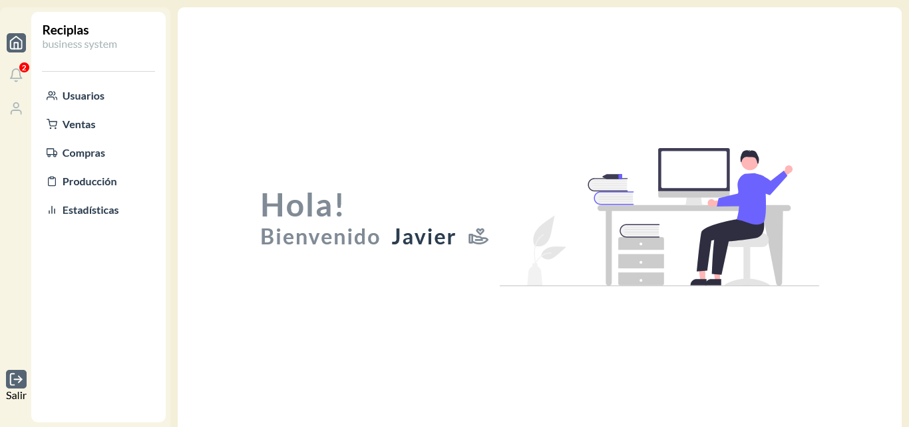

## Screenshot

### Guia de instalación

- Descargar repositorio completo
- Abrilo con un editor (Visual Studio Code)
- ejecutar los siguiente comandos:
- npm i
- npm i sass
- npm run dev
- colocar la direccion que brinda la consola en un navegador web.
- Datos para loguearse:
- usuario: admin@gmail.com
- contraseña: admin

### Built with

- Semantic HTML5 markup
- CSS custom properties
- React
- Javascripts
